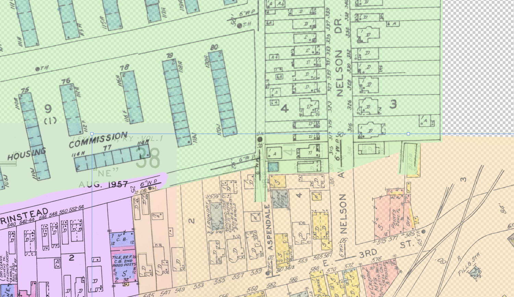

# Mapping changes in Lexington's East End, 1934-1958

This project is an interactive map of a portion of Lexington, Kentucky's East End neihborhood developed through QGIS and Mapbox. It georeferenced images of fire insurance maps from 1934 and 1958 over present-day satellite imagery to show where the old Kentucky Association thoroughbred racetrack and Bluegrass-Aspendale housing projects used to be. Users can interact with both maps by zooming in and panning across the highly detailed historical maps and interpret how dramatically the area has changed over the past hundred years.

## Data

The high-resoltion TIFF images used in this project came from the digital collections of the Library of Congress:
- Sanborn Map Company (1934). _Sanborn Fire Insurance Map from Lexington, Fayette County, Kentucky._ Plates [38](https://www.loc.gov/resource/g3954lm.g032001934/?sp=39&st=image), [41](https://www.loc.gov/resource/g3954lm.g032001934/?sp=42&st=image), and [42](https://www.loc.gov/resource/g3954lm.g032001934/?sp=43&st=image).
- Sanborn Map Company (1958). _Sanborn Fire Insurance Map from Lexington, Fayette County, Kentucky._ Plates [38](https://www.loc.gov/resource/g3954lm.g03200195801/?sp=49&st=image), [41](https://www.loc.gov/resource/g3954lm.g03200195801/?sp=52&st=image), [60](https://www.loc.gov/resource/g3954lm.g03200195801/?sp=71&st=image), and [62](https://www.loc.gov/resource/g3954lm.g03200195801/?sp=73&st=image).

## Process

Once the historic map scans were acquired, I stitched the different pages from the same year into one large and continuous image on Photoshop using tools like Puppet Warp.

 
Next, I used the raster tools in QGIS 3.22.5 on Windows 10 to georeference the two combined images (from 1934 and 1958) with the help of a Google Maps satellite basemap. Fortunately, although the East End has gone through multiple phases of urban renewal, each page of the Sanborn maps had at least a few property boundaries that had remained constant since the 1930s. Therefore, I was also able to use the Lexington-Fayette Urban County Government's official [parcel shapefiles](https://data.lexingtonky.gov/datasets/e4a525d8772741468205e82fc173db22_0/explore) to match certain features to the corresponding coordinates.

 
Finally, I uploaded the georeferenced TIFF files as tilesets in Mapbox and created a new style that uses satellite imagery and basic street and place name labels as the basemap.

## Improvements

Eventually, my goal is to take this project up again and learn how to create an interface that allows users to turn certain layers on and off as well as adjust their opacity so that multiple historical layers can be stacked on top of one another in the same interactive frame.

## Use

As I alluded to above, Lexington's East End has underwent many physical and social changes since the Great Depression, many of which are invisible or barely perceptible in the landscape today. I wanted to draw on some of the research I did for my MA in Geography to develop and share a tool that would allow anyone to start exploring these changes.